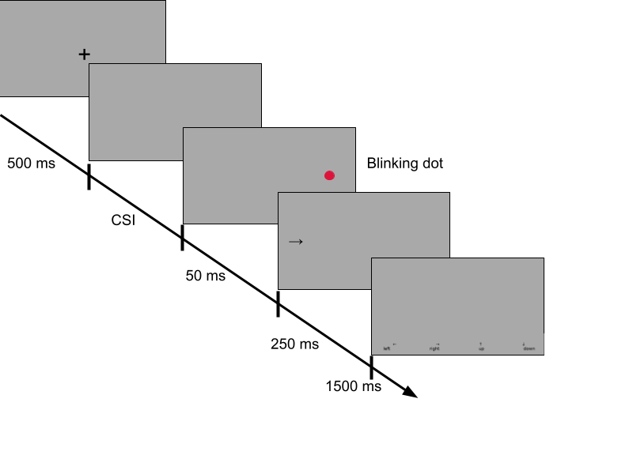

```{r setup, include=FALSE}
knitr::opts_chunk$set(echo = FALSE)
knitr::opts_chunk$set(warning = FALSE, message = FALSE) 
```


```{r}
#| include: false
#| label: load-packages
library(tidyverse)
library(readr)
library(broom)
library(papaja)
library(scales)
library(latex2exp)
```

# Introduction
Whether the stimulus discrimination performance `increases` (e.g., due to goal strengthening),
`decreases` (e.g., due to vigilance decay), or `varies periodically` (e.g., along attentional rhythms) as a
function of time elapsing between task onset (fixation point, cue) and stimulus (cue-stimulus interval;
CSI) is debated in the current literature on attention, and so far the findings **are equivocal**.


# Method
In order to precisely examine the role of CSI in stimulus discrimination, we used the classic
`antisaccade task` with **CSI** varied in `millisecond steps`. On each trial, participants were shown for **250 ms** either `left or right arrow` as a target, and their task was to indicate which arrow was displayed by
`pressing the appropriate key`. The arrows were randomly displayed on either the **left or right side of the screen**. The stimulus was accompanied by a `red dot` briefly flashing on the **opposite side of the screen**, which should be ignored. The fixation point and the red dot/stimulus presentation were
separated by a `blank screen` shown for **CSI ranging**.

{width=115%}

# Datasets    

We conducted two experiments, one with lower resolution (less trials per participant) but a larger
sample and the other with higher resolution but a smaller
sample.

**`Param`** | <span style="color:#a1c549">Bigger low-res</span> | <span style="color:#ce8dff">Smaller high-res</span> |
|:-----------------:|:-------------------:|:---------------------:|
| **N**             |            150      |            40         |
| **Sampling freq** |      60 Hz          |            120 Hz     |
| **CSI Step**      |        16.6 ms      |         8.3 ms        |
| **CSI Range**     |   350-1000 ms       |    400-900 ms         |
| **Unique CSI's**  |        40           |        61             |
| **Reps per CSI**  |        11           |          104          |
| **Trials**        | 440 per person      |  6344 per person      |

For each participant, the mean accuracy was calculated for each CSI timepoint. These mean accuracy values were plotted as a function of increasing CSI, with a single curve created for each person. 

```{r include=FALSE}
# load data

data.A.names <-
  list.files('../../Experiment_1/Data/Data_A/',
             full.names = T,
             pattern = '*.csv$')
data.A <- read_csv(data.A.names)

data.B.names <- c(
  list.files(
    '../../Experiment_1/Data/Data_B/Cohort_1/',
    full.names = T,
    pattern = "*.csv$"
  ),
  list.files(
    '../../Experiment_1/Data/Data_B/Cohort_2/',
    full.names = T,
    pattern = "*.csv$"
  )
)

data.B <-
  read_csv(data.B.names) |>
  separate(PART_ID, c("Part_id", "Session"), sep = -2)
```

```{r}
# aggregate data over CSI
data.A.aggr <-
  data.A |>
  filter(Trial_type == "experiment", Rt > 0.0) |> # Experiment and no timeout
  select(PART_ID, CSI, Corr) |>
  mutate(t = CSI * 16.6) |>
  filter(t > 350) |>
  group_by(PART_ID, t) |>
  summarise(mean_corr = mean(Corr))

data.B.aggr <-
  data.B |>
  filter(Trial_type == "experiment", Rt > 0.0) |> # Experiment and no timeout
  select(Part_id, CSI, Corr) |>
  mutate(t = CSI * 8.3) |>
  group_by(Part_id, t) |>
  summarise(mean_corr = mean(Corr))

```

```{r fig.width=10.7, fig.height=5.2}
data.B.aggr |> 
  filter(Part_id == "157K25") |>
  ggplot(mapping = aes(x=t, y=mean_corr)) +
  geom_point() +
  geom_line() + 
  geom_smooth(method='lm', formula = y ~ x) +
  theme_apa() +
  ggtitle("Single participant data") + 
  scale_y_continuous(labels = scales::percent) +
  labs(x = "time in [ms]", y = "Avg correctness") +
  theme(plot.title = element_text(size = 28, face = "bold", color="#ce8dff"))
```

# Results

The curves described above were used to analyze the potential presence of an **increasing** or **decreasing** `trend`, and a `periodic variation`.

## Trend 

The first analysis consisted of fitting a regression line for each participant. The
slopes of the fitted regression were then subjected to a one-sample t-test comparing their mean with the zero value. 

```{r include=FALSE}
betas.A <- data.A.aggr |>
  do(model = lm(mean_corr ~ t, data = .)) |>
  mutate(beta  = model$coefficients[[2]]) 

betas.B <- data.B.aggr |>
  do(model = lm(mean_corr ~ t, data = .)) |>
  mutate(beta  = model$coefficients[[2]]) 
    

```

```{r include=FALSE}


```
```{r}
tA.shapiro <- shapiro.test(betas.A$beta)
tA.t <- t.test(betas.A$beta)
tB.shapiro <- shapiro.test(betas.B$beta)
tB.t <- t.test(betas.B$beta)
```


```{r fig.width=10.2, fig.height=5.2}
tA <- TeX(apa_print(tA.shapiro)$full_result)
tB <- TeX(apa_print(tB.shapiro)$full_result)
ggplot() +
  geom_density(data = betas.A, aes(x = beta), color = '#a1c549') +
  geom_density(data = betas.B, aes(x = (2.6 * beta)), color = '#ce8dff') +
  stat_function(
    fun = dnorm,
    args = list(mean = 0, sd = sd(betas.A$beta))
    ,
    n = 150,
    color = '#f9948d'
  ) +
  theme_apa() +
  ggtitle("Beta coefs. distribution", subtitle = "Plotted against an ideal gaussian cenetered at zero (red)") +
  labs(x = "", y = "") +
  scale_x_continuous(labels = label_comma(),  limits = c(-0.0003, 0.0003)) +
  theme(
    axis.text.y = element_blank(),
    axis.ticks.y = element_blank(),
    legend.position = "none",
    plot.title = element_text(size = 28, face = "bold"),
    plot.subtitle = element_text(size = 20, color = '#f9948d', face="bold")
  ) +  #remove y axis ticks)
  annotate("text", size = 7,
           x = -.00025,
           y = 5000,
           label = "Shapiro-Wilk:") +
  annotate("text",x = -.00024,y = 4300,label = tA,parse = TRUE,size = 7, colour = '#a1c549') +
  annotate("text",x = -.00024,y = 3500,label = tB,parse = TRUE,size = 7, colour = '#ce8dff') 
```

The colored curves represent beta variable distribution for <span style="color:#a1c549">bigger low-res</span> and <span style="color:#ce8dff">smaller high-res</span> datasets respectively. 
Both curves did not show evidence of non-normality and are showing significant difference from a zero distribution (**p<.001**).
However, both effects are, in our opinion, negligibly small (<span style="color:#a1c549">4.15% </span> and <span style="color:#ce8dff">4.58% </span> of increased avg. accuracy over 1000 ms).  

## Periodic variation
The periodicity analysis was performed on the frequency spectrum of <span style="color:#ce8dff">smaller high-res</span> dataset calculated for each
participant using the `Fourier transform`. Periodicity would be detected when the power of any of the
examined frequency bands was significantly higher than the random level. The mean correctness for
each subject was `permuted 10,000 times`, creating artificial signals that were then Fourier-transformed.
Thus, the power distribution of each frequency band in the absence of periodicity was known. The
comparison of the power obtained in the experiment with the permutationally determined random
level was done using both `Holmes adjusted` and raw directional p-tests.

```{r}
per.data <- tribble(~ "Frequency [Hz]", ~ Estimate, ~ "p value", ~ "p adj",
        0, 0.086, .85, ">.99",
        1.277,0.435,.3, ">.99",
        2.553,0.612,.99,"> .99",
        3.83,0.661,.76,"> .99",
        5.106,0.603,.1,"> .99",
        6.383,0.537,.82,"> .99",
        7.66,0.573,.95,"> .99",
        8.936,0.554,.96,"> .99",
        10.213,0.542,.75,"> .99",
        11.489,0.602,.23,"> .99",
        12.766,0.59,.74,"> .99",
        14.043,0.595,.28,"> .99",
        15.319,0.555,.65,"> .99",
        16.596,0.639,.054,"> .99",
        17.872,0.607,.35,"> .99",
        19.149,0.535,.91,"> .99",
        20.426,0.548,.86,"> .99",
        21.702,0.601,.47,"> .99",
        22.979,0.592,.41,"> .99",
        24.255,0.516,.44,"> .99"
)
knitr::kable(per.data, "pipe", align = "cccr")
```

# Conclusion
We conclude that the correctness of solving the anti-saccade task `does not oscillate in the CSI function` but shows `a small trend effect`. These findings contradict some of the literature on behavioral oscillations. We are planning further experiments to explain this phenomenon in wider CSI intervals, `up to 3000 ms`.

<!-- ```{r, include=FALSE} -->
<!-- knitr::write_bib(c('knitr','rmarkdown','posterdown','pagedown'), 'packages.bib') -->
<!-- ``` -->

<!-- # References -->
